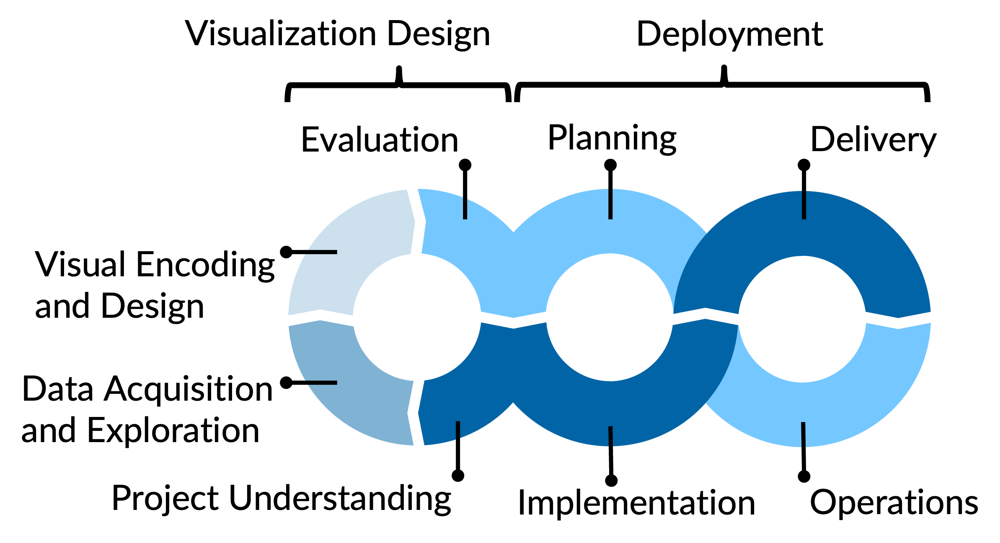

## At a glance

An interactive Streamlit dashboard that turns Formula 1 timing and telemetry data into a post-race analysis tool for Team Ferrari. Users pick a season and Grand Prix, and the app loads the corresponding race data from the [FastF1](https://docs.fastf1.dev/) API and visualises it across five focused views.

::: {.callout-tip}
## Try it out
- **Live app:** [ds24t-3.streamlit.app](https://ds24t-3.streamlit.app)
- **Source code:** [github.com/vdss-fs26-ds24t/ds24t-3-fancyproject](https://github.com/vdss-fs26-ds24t/ds24t-3-fancyproject)
:::

## What the application does

| View | What you see |
|------|--------------|
| **Home** | KPI cards and a strategy snapshot for the selected race |
| **Strategy** | Stint bars per driver and position progression over the race |
| **Lap Times** | Lap-by-lap times with stint and compound colouring, plus competitor overlays |
| **Telemetry** | Driver-vs-driver comparison of speed, throttle, brake and gear over distance |
| **Track Map** | Circuit outline coloured by speed, throttle or brake for any selected lap |

The race selector in the sidebar drives every page; switching the race reloads the data once and warms the telemetry cache in the background.

## Documentation contents

- **[Project Charter](project_charta.qmd)** — Context, goals, personas (Marco the strategy engineer, Giulia the data journalist), stakeholder analysis, success criteria and the visualisation concept.
- **[Data Report](data_report.qmd)** — Data sources, processing pipeline and exploratory analysis of FastF1 lap and telemetry data.
- **[Visualization Design Report](viz_design_report.qmd)** — Per-chart encoding rationale, design principles (Bertin, Cleveland-McGill, Tufte, Wilke) and design iterations.
- **[Streamlit App](https://ds24t-3.streamlit.app)** — The deployed dashboard.
- **[Presentation](presentation.qmd)** — Final project presentation slides.

## Development process

{#fig-vizprocess width=80%}

The work follows the four-phase process in @fig-vizprocess, based on @DoemerKempf2022_1000150238 and the [data science project template](https://github.com/phonosync/dataviz-project-template): **Project Understanding → Data Acquisition & Exploration → Visual Encoding & Design → Evaluation & Deployment**.

## Tech stack

| Layer | Tool |
|-------|------|
| Data | FastF1 (Python) |
| Processing | Pandas, NumPy |
| Visualisation | Plotly (dark theme, Ferrari red `#e8002d`) |
| App framework | Streamlit |
| Documentation | Quarto on GitHub Pages |
| Hosting | Streamlit Community Cloud |

## Team

Claudio Calamia · Stefan Hohl · Fynn Fischer — ZHAW BSc Data Science, DS24T-3.
